# MOS 2.2 - Informatique Graphique

## Table of contents

I. [Ray Tracing](#raytracing)

1.  [Ray Tracing primitif](#raytracingprimitif)
2.  [Ajout de l'intensité lumineuse](#intensitelumineuse)
3.  [Création d'une scène](#scenecreation)
4.  [Correction Gamma](#correctiongamma)
5.  [Ombres portées](#ombresportees)
6.  [Surfaces miroir](#surfacesmiroir)
7.  [Surfaces transparents](#surfacestransparentes)
8.  [Transmission de Fresnel](#fresnel)
9.  [Eclairage indirect](#eclairageindirect)

    a) [Generation de nombre aléatoire](#randomnumber)

    b) [Résultat de l'éclairage indirect](#resulteclairageindirect)

10. [Parallélisation des calculs](#parallelisation)
11. [Crénelage](#crenelage)
12. [Ombres douces](#ombredouce)

    a) [Approche naïve](#approchenaive)

    b) [Approche intégrale](#approcheintegrale)

13. [Changement du modèle de caméra](#changementcamera)

14. [Maillage](#maillage)

    a) [Maillage naïf](#maillagenaif)

    b) [Boîte englobante](#boiteenglobante)

    c) [Maillage optimisé](#maillageoptimise)

    d) [Optimisation des normales](#normalesoptimisees)

II. [Feedback sur le MOS](#feedback)

Enseignant : Nicolas Bonneel

Etudiant : Julien Verdun

Date : 06/01/2021

## Ray Tracing 

Le ray tracing est une technique de calcul d'optique par ordinateur, utilisée pour le rendu en synthèse d'image ou pour des études de systèmes optiques

On décrit dans cette partie l'implémentation d'un algorithme de **Ray Tracing**. Les différentes étapes permettant de complexifier notre algorithme sont expliquées.

Le fichier `raytracer.cpp` contient les classes **C++** et le **main** nécessaires pour créer les images présentées plus bas.

### Ray Tracing primitif 

Le premier Raytracer implémenté est très rudimentaire.

On représente une **source de lumière blanche** par une source omnidirectionnelle placée en un point L.
Une caméra est placée en un point C. Elle est composée d'une grille de pixels placée à une distance Z de C et de taille (W,H), soit W\*H pixels au total.

Dans un premier temps, on place une sphère devant la caméra. C'est une sphère de centre O et de rayon R.

La démarche est la suivante. On trace des demi-droites partant du centre de la caméra C et dirigé par un vecteur **u**. Une demi-droite traverse la grille en un pixel, il y a donc W\*H demi-droites, passant par C et dirigée par le vecteur unitaire :

**u** = ( j-W/2, i-H/2, -W/(2.tan(&alpha;/2)))

où (i,j) sont les coordonnées du pixel sur l'écran de la caméra.

Pour chaque demi-droite, on calcule l'intersection avec la sphère.
On résoud :

t2 + 2.t.&lt;**u**,**CO**&gt; + ||**CO**||2 - R2 = 0

Si l'intersection existe (**au moins une solution t positive**), on représente le pixel correspondant en blanc, sinon on le laisse noir.

Ainsi on obtient la Figure représentée ci-dessous. La sphère est bien représentée en blanc et le reste en noir.

**Remarque :** avec cette méthode assez primitive, il n'est pas possible d'observer le volume de la sphère, ainsi que les ombres créées par la lumière.

Les classes implémentées sont les suivantes :

- une classe **Vector** : elle contient les coordonnées du vecteur et différentes méthodes pour surcharger les opérations d'addition, soustraction, produit scalaire et produit par une constante ainsi que de calcul de la norme
- une classe **Sphere** : elle contient le centre et le rayon de la sphère
- une classe **Ray** : elle contient un point du rayon et son vecteur directeur.

### Ajout de l'intensité lumineuse 

On change ici la couleur attribuée à un pixel de la caméra afin d'obtenir du contraste et de discerner les volumes des objets.

Au lieu de donner une couleur blanche à un pixel dont un rayon serait entré en collision avec un objet, on donne une couleur dont l'intensité est variable.

On calcule l'intensité de la lumière en un point P d'un objet selon la formule :

Ip = I/(4.&pi;.||**LP**||2) . &lt;**N**,**PL**/||**PL**||&gt; . &rho; / &pi;

avec :

- I l'intensité de la source lumineuse au point L
- **N** la normale à l'objet (la sphère) au point P (vecteur unitaire)
- &rho; l'albédo de la sphère, i-e la fraction de la lumière que la sphère réfléchit.

Ainsi on obtient la Figure représentée ci-dessous. La sphère, représentée avec un albedo rouge, est bien représentée en rouge et le reste en noir. On peut cette fois mieux apprécier le volume de la sphère et on peut clairement identifier la localisation de la source de lumière grâce aux différences d'intensiter lumineuses (les ombres sont mieux représentés). Ce raytracer est plus performant que la version précédente.

### Création d'une scène 

On désire à présent **complexifier la scène observée**. Jusqu'à présent, seul une sphère était placée devant la caméra.

On implémente une classe **Scene** contenant un vecteur d'objets, qui contiendra les objets (par exemple des sphères) placés devant la caméra.

Afin de bien représenter les objets les un par rapport aux autres, il convient de pouvoir déterminer leur profondeur dans l'espace. Ainsi pour réaliser cette modification, une méthode est implémentée afin de vérifier pour un rayon donné, les objets de la scène qui intercepte ce rayon, et de ne garder que l'objet le plus proche de la caméra (l'objet qui va cacher les objets derrière lui).

On réalise un essai en créant une scène composée de :

- trois sphères, de gauche à droite bleue, blanche et rouge
- 2 murs à gauche et à droite respectivement bleu et rouge
- 2 murs en face de la caméra et derrière la caméra (invisible donc) respectivement vert et magenta
- 1 mur au sol de couleur blanche.

Les murs sont représentés par des sphéres de très grand rayon et de centre très éloigné.
Le résultat obtenu est présenté sur la Figure ci-dessous :

**Remarque** : Le résultat est assez satisfaisant, toutefois certaines améliorations sont possibles :

- les ombres des sphères ne sont pas projetées sur les murs alentours
- la luminosité de la lumière sur les murs est très faible, leur couleur n'est pas très bien perceptible.

### Correction Gamma 

On se propose ici d'améliorer le contraste des objets. En effet, sur la dernière scène obtenue, nous avons relevé la faible luminosité des murs en arrière plan.

La **correction Gamma** permet d'améliorer le contraste en réalisant une opération simple sur l'intensité lumineuse calculée de chaque pixel :

I = Icalculee1/&gamma;

avec &gamma; = 2,2 et 1/&gamma; = 0,45.

La correction Gamma permet d'obtenir le résultat ci-dessous. La luminosité des pixels représentant les murs est plus importante. Le rendu est meilleur.

### Ombres portées 

On souhaite encore améliorer le rendu en ajoutant les **ombres portées**, c'est-à-dire les ombres des objets projetées sur les surfaces.

La stratégie est la suivante. On envoie des rayons dans toutes les directions (vers chaque pixel de l'écran). Pour un rayon donné, on trouve l'intersection avec un objet de la scène puis on regarde si le rayon entre cette intersection et la source de lumière coupe un autre objet. Si tel est le cas, on rend le pixel d'intersection plus sombre.

On obtient un premier résultat présenté sur la Figure ci-dessous. On remarque que les ombres sont bien présentes, toutefois, l'image est très bruitée.

Le bruit s'explique par les incertitudes de calcul dû à la précision numérique de la machine. Ainsi, le point d'intersection se retrouve dans la surface au lieu d'être sur la surface. Pour éviter cela, on déplace le point d'intersection d'une petite quantité &epsilon; vers l'extérieur de l'objet.

Avec cette légère modification, on obtient le résultat présenté ci-dessous, le bruit n'est plus présent et les ombres sont bien visibles.

### Surfaces miroir 

Les surfaces représentées jusqu'à présent sont des surfaces opaques qui possèdent un albédo. On se propose ici de représenter un autre type de surface, les **surfaces miroir**.

Un rayon lumineux se reflète sur une telle surface avec un angle de réflexion par rapport à la normale de la surface égal à l'angle d'incidence. Les réflexions peuvent être multiples dans le cas de plusieurs surfaces miroir.

On implémente ces types de surfaces en créant une fonction getColor récursive qui permet de donner la couleur entre l'intersection d'un rayon et d'une surface opaque, ou le cas écheant entre le rayon réfléchi et une surface miroir.

Avec cette propriété, notre **raytracer** devient un **pathtracer**.

Le rayon incident **i** est réfléchi par la surface miroir en un rayon **r** tel que :

**r** = **i** - 2<**i**,**N**>**N**

On remplace la sphère centrale des scènes précédentes par une surface miroir. On obtient le résultat ci-dessous.

On rencontre le même problème que précédemment, du bruit est présent sur la surface dû aux erreurs numériques. Le résultat après correction est le suivant.

La sphère centrale permet bien de refléter le mur derrière l'écran, le mur magenta et les sphères et murs environnants.

### Surfaces transparents 

On se propose ici de représenter un autre type de surface, les **surfaces transparentes**.

On fait l'hypothèse qu'une surface transparente réfléchie l'intégralité d'un rayon ou transmet l'intégralité du rayon, on ne tient pas compte de la **transmission de Fresnel**.

On utilise la **loi de Snell-Descartes**, pour une surface de normale **N** séparant deux milieux d'indices respectifs n1 et n2, un rayon incident dans le milieu d'indice n1 avec un angle &theta;i est transmis dans le milieu d'indice n2 avec un angle &theta;t tel que :

n1 sin(&theta;i) = n2 sin(&theta;t)

Grâce à cette loi, on peut exprimer les composantes tangentielle et normale du vecteur unitaire directeur du rayon transmis **T** :

**TN** = - &radic;(1 - (n1/n2)2(1-<**i**,**N**>2)) **N**

**TT** = n1/n2 (**i** - <**i**,**N**>**N**)

Connaissant la direction du rayon tranmis par la surface transparente, il est alors possible de connaître la couleure du pixel à afficher en cherchant l'intersection de ce rayon avec le reste de la scène.

On modifie la sphère de droite (sphère rouge) en une surface transparente. On obtient le résultat présenté sur la Figure ci-dessous. La sphère est bien transparente et laisse apparaître avec une inversion de la direction les murs de droite et du fond.

Une autre représentation est visible ci-dessous en remplaçant le sol par un miroir.
On calcule le temps nécessaire pour créer cette scène. L'algorithme donne les performances suivantes :

- 0.918 seconde pour générer l'image sans le sol en miroir
- 1.137 secondes pour générer l'image avec le sol en miroir.

### Transmission de Fresnel 

Lors de la transmission d'un rayon par une surface transparente, une partie du rayon est en réalité réfléchie par la surface, selon les lois de Fresnel.

Dans l'approximation de Schlick, le rayon incident se divise en un rayon réfléchi **R** et un rayon transmis **T** selon les formules suivantes :

R = k0 + (1-k0)(1-|<**N**,**i**>|)5

T = 1 - R

avec k0 = (n1-n2)2/(n1+n2)2

Pour implémenter la transmission de Fresnel, deux stratégies ont été testées.

La **première stratégie** consiste à calculer la valeur d'un pixel transparent en faisant une moyenne pondérée par les coefficients R et T du rayon réfléchi et du rayon réfracté. L'inconvénient de cette méthode est son temps de calcul. En effet, la méthode de calcul de la couleur étant récursive, l'appeler 2 fois pour calculer la valeur d'un pixel transparent conduit à fait 2N calcul pour N rebonds, la complexité devient très vite importante.

Les résultats de cette méthode sont très concluants puisqu'en moins de 2 secondes, les deux images ci-dessous sont générées avec un rendu proche de la réalité.

La **deuxième stratégie** consiste à calculer la valeur d'un pixel transparent en faisant une moyenne de plusieurs chemins complets pour lesquels à chaque intersection avec une surface transparente, on choisit aléatoirement d'émettre un rayon réfléchi ou réfracté, en générant un nombre entre 0 et 1, et en le comparant au coefficient R. Si le nombre généré est inférieur à R, le rayon sera réfléchi, sinon il sera réfracté.

Les résultats de cette méthode semble un peu moins performant. en effet, en générant et moyennant la valeur du pixel pour 30 rayons complets, on obtient le résultat ci-dessous. La qualité de la transparence est moins importante qu'avec la première méthode, on observe un léger bruit. De plus, le temps pour générer l'image est plus grand avec environ 6 secondes pour 10 rayons et 20 secondes pour 30 rayons.

### Eclairage indirect 

Avec le pathtracer actuel, les surfaces avec un éclairage rasant possèdent une faible intensité lumineuse.

En réalité, les surfaces environnentes réflechissent une partie de la lumière pour éclairer ces surfaces "rasantes" et ainsi augmenter la quantité de lumière observée. Ainsi les surfaces se comportent comme des sources de lumière secondaires. On parle d'**éclairage indirect**.

L'idée est la suivante. On considère que chaque rayon qui arrive sur un pixel de la caméra est la combinaison de la lumière réfléchie par la source lumineuse ponctuelle sur la surface intersectée, plus une quantité de lumière qui provient de la réflection d'autres rayons sur des surfaces.

La première quantité est celle que l'on calcule déjà.

La deuxième se calcule avec l'intégrale sur la demi-sphère S+ de la quantité :

&int; f(**wi** , **wo**) . L(**wi**) . <**N**,**wi**> . dwi

avec f la **BRDF** (Bidirectional Reflectance Distribution Function) fonction telle que :

- f &ge; 0
- f(**wi** , **wo**) = f(**wo**,**wi**) (condition de réciprocité)
- &int; f(**wi** , **wo**) . cos(**wi**) dwi &le; 1 pour tout **wo** (conservation de l'énergie).

Le calcul de l'intensité lumineuse sur un pixel de l'écran constitue une équation de Fredholm du 2ème type. En effet, le calcul de l'intensité d'un rayon nécessite le calcul de l'intensité d'un autre rayon.  
Il est ainsi possible de calculer l'émission du rayon arrivant sur l'écran en se limitant à un nombre de rebonds, par exemple **5 rebonds**, et en calculant récursivement l'intensité du rayon. Cela reprend ce qui a été fait pour les mirroirs et les surfaces transparentes.

La problématique est ici le fait qu'un nombre infini de rayon sont la cause de l'éclairage indirect, or pour des raisons évidentes de performance, il n'est pas possible de tous les prendre en compte. Ainsi, on se limite à un rayon par surface.

Le rayon **wi** est dirigé par les vecteurs **N**, **T1** et **T2** tel que :

**wi** = z.**N** + x.**T1** + y.**T2**

avec :

- x = cos(2.&pi;.r1) &radic;(1-r2)
- y = sin(2.&pi;.r1) &radic;(1-r1)
- z = &radic;(r2)

avec **z** dirigé par **N** puis

**T1** est calculé selon la valeur minimale de **N** afin de s'assurer que l'on ait pas **N** = (0,0,1) et ainsi **T** = **0** :

- **T1** = (-Ny,Nx,0) si Nz est minimale
- **T1** = (Nz,0,-Nx) si Ny est minimale
- **T1** = (0,-Nz,Ny) si Nx est minimale

et **T2** = **N**&#10799;**T1**

Le calcul d'un seul rayon indirect par surface est amélioré en générant un certain nombre de rayons par pixel de l'écran, par exemple 100 rayons, qui se propagent différements (de manière aléatoire) et dont on moyenne les intensités lumineuses afin d'espérer obtenir l'intensité moyenne du pixel.

#### Generation de nombre aléatoire 

La génération de nombre aléatoire est réalisée en utilisant la **formule de Box Muller**.

On génère deux nombres aléatoires u1 et u2 suivant une loi uniforme sur [0,1]
puis on calcule deux nombres aléatoires :

x1 = &sigma; . cos(2 &pi; u1) . &radic;(-2 log(u2))

x2 = &sigma; . sin(2 &pi; u1) . &radic;(-2 log(u2))

x1 et x2 suivent alors une loi Gaussienne d'écart-type &sigma;.

#### Résultat de l'éclairage indirect 

Les résultats ci-dessous présentent le résultats de l'implémentation de l'éclairage indirect.

Avec un seul rayon indirect généré aléatoirement par surface, on obtient le résultat ci-dessous en environ 1 seconde. L'image semble bruitée, le résultat n'est pas suffisament performant.

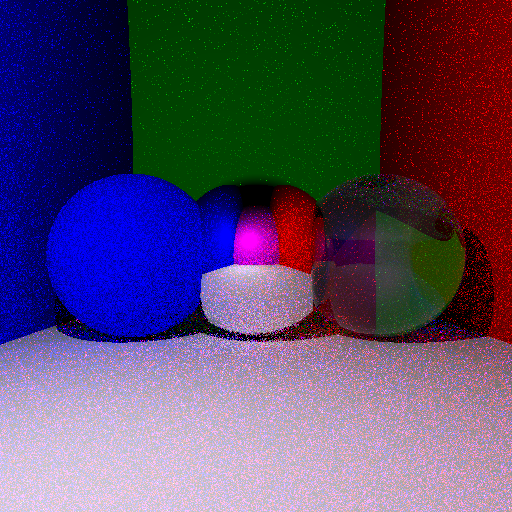

Avec 10 rayons indirects générés aléatoirement par surface, on obtient le résultat ci-dessous en environ 10 secondes. L'image semble toujours bruitée mais le résultat est plus satisfaisant que le précédent.

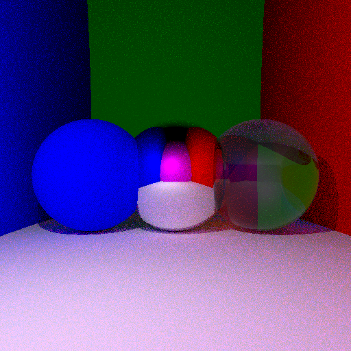

Avec 100 rayons indirects générés aléatoirement par surface, on obtient le résultat ci-dessous en environ 100 secondes. On aperçoit encore légèrement le bruit même si le résultat est très satisfaisant.

Lorsque l'on compare ce résultat avec l'image sans éclairage indirect, on s'aperçoit entre autre que le sol, qui apparaissait blanc (sa couleur de définition), possède maintenant une teinte influencée par la couleur des murs qui l'entourent (bleu et rouge).

L'image ci-dessous présente la combinaison de l'éclairage indirect et de la transmission de Fresnel au niveau de la sphère transparente, en combinant les méthodes aléatoires pour optimiser les calcules, on obtient le résultat en 80 secondes, 20 secondes de moins que précédemment.

### Parallélisation des calculs 

Chaque pixel de l'image étant calculé de manière indépendante des autres pixels, on peut paralléliser la boucle de l'algorithme afin que les calculs soient exécutés en parallèle.

En appliquant cette méthode, on parvient à réduire le temps d'exécution de notre algorithme à 10 secondes contre 80 secondes précédemment.

### Crénelage 

Lorsque l'on observe une des images générées précédemment, on s'aperçoit que les bords des surfaces sont crénelés (en forme d'escalier).

La raison de ce phénomène est que les rayons intersectent l'écran au milieu des pixels et deux rayons issues de deux pixels voisins peuvent, avec la distance entre l'écran et la surface, ne pas tout les deux appartenir à la surface ou inversement.

Ainsi, pour supprimer ce crénelage, il convient de ne pas faire passer tout les rayons par le centre du pixel mais de les faire passer par un point du pixel de sorte à ce que la distribution des intersections des rayons sur le pixel suive une loi Gaussienne centrée sur le pixel.

Les 100 rayons générés pour l'éclairage indirect sont ainsi utilisés avec des coordonnées légèrement différentes afin de d'augmenter la diversité des rayons.

On obtient le résultat ci-dessous, le crénelage n'est plus visible.

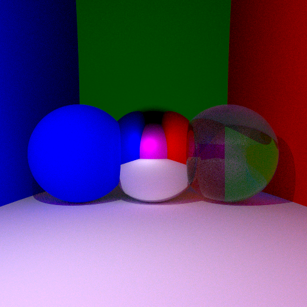

### Ombre douce 

Jusqu'à présent, nous utilisions une source de lumière ponctuelle, qui émet dans toutes les directions de l'espace, pour éclairer la scène.

Cela conduit notamment à des ombres très tranchées.
Afin d'adoucir les ombres, on se propose ici de remplacer cette source ponctuelle par une **surface émissive**, une sphère par exemple.

L'éclairage indirect n'est pas impacté par cette modification en revange l'éclairage indirect n'est calculé de la même manière.

#### Approche naive 

Dans une première approche dîtes naïve, on retire la source ponctuelle et on ne prend en compte que les reflets sur une surface émissive (sphère blanche) d'intensité lumineuse :

I / 4 &pi;2R2

Le résultat de l'approche naïve est présenté ci-dessous. Pour une surface émissive de rayon 5, l'image est très bruitée, le résultat est moins bon que précédemment. La source est visible dans le mirroir.

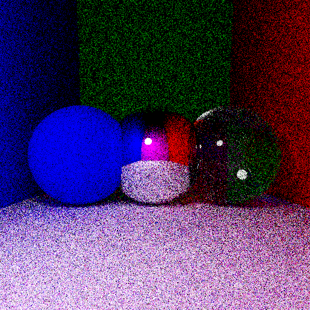

En augmantant le rayon de la source ponctuelle à 15, le résultat est meilleur, l'image est moins bruitée.

**Remarque** : on aperçoit la surface émissive en haut à gauche de l'image.

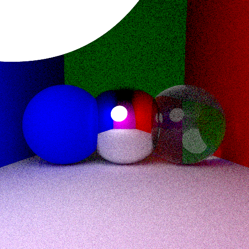

#### Approche intégrale 

Quant il suffisait de viser la source ponctuelle avec un rayon pour calculer l'éclairage direct dans le modèle précédent, il s'agît à présent d'intégrer sur la demi-sphère de la surface émissive qui "voit" la surface éclairée.

L'intégration sur cette demi-sphère se fait en discrétisant la surface en élément de surface tiré aléatoirement par une loi de Monte Carlo

On peut alors réécrire l'**équation du rendu** en réalisant un changement de variable, on intègre sur les éléments d'air de la scène la quantité :

&int; f(**wi**(x') , **wo**) . L(**wi**(x')) . cos(**&theta;i**) . J(x') . dx'

avec J le **jacobien** tel que :

J(x) = cos(&theta;') . V(x,x') / ||x-x'||2

et :

- V le **facteur de visibilité** (vaut 0 ou 1 selon que x' est visible depuis x)
- cos(&theta;') = <**N'**-**wi**(x')>

Afin d'améliorer le calcul de l'intégral, on réalise un **échantillage** des points de la surface. Grâce à la méthode de Monte Carlo, des points sont tirées aléatoirement selon une loi Gaussienne sur la demi-sphère de centre L, de rayon R et pointant vers x.

On peut en déduire l'intensité lumineuse dû au point généré aléatoirement x' :

Ix' = Ilum/(4.&pi;2.R2) . &rho; / &pi; . &lt;**N**,wi(x')&gt; . J / p(x')

avec p(x') = &lt;**Lx**,**Lx'**&gt; / &pi;.R2

Les Figures ci-dessous montrent les résultats de cette méthode.

Les deux images ci-dessous montrent le résultat pour des surfaces émissives de rayon 1 et 15.

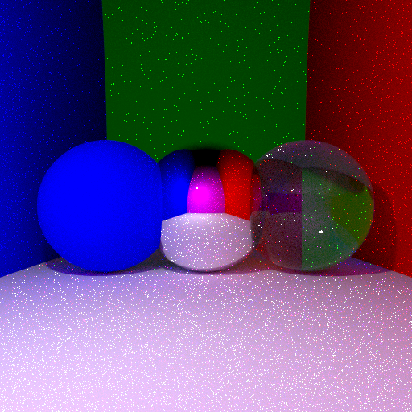

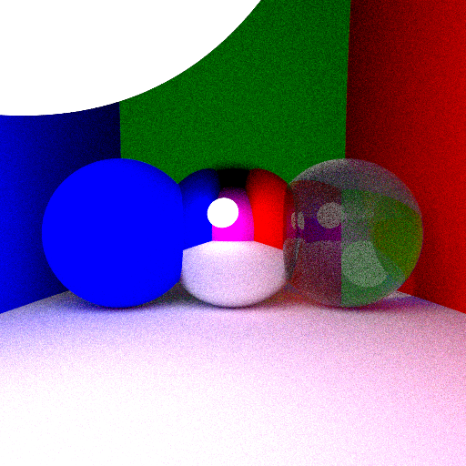

Un léger bruit est toujours présent dû notamment aux approximations numériques qui reste des cas rares.

En corrigeant le problème et toujours avec une source de rayon 1 on obtient un meilleur résultat ci-dessous.

La Figure ci-dessous présente le résultat pour une surface émissive de rayon 5.
On observe une **caustique** (zone où la lumière de la surface émissive est concentrée) sous la boule transparente.

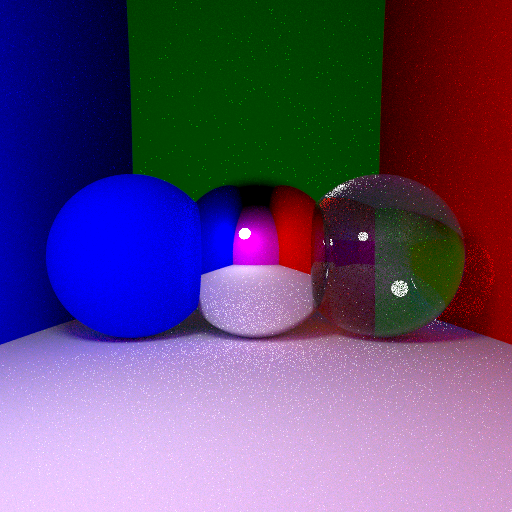

### Changement du modèle de caméra 

La caméra utilisée initialement était une caméra fonctionnant comme un obturateur ponctuel. On modélise ici la caméra par un obturateur d'ouverture non ponctuel. Le point C représentant la caméra est maintenant une variable aléatoire Gaussienne centrée autour de C.

Avec un tel dispositif, des objets qui ne sont pas à la même distance n'ont pas la même nêteté, cela dépend de la **profondeur de champ**. Les objets dont l'image arrive sur le capteur seront nets tandis que les autres objets seront plus flous à cause de la zone de confusion dû à l'obturateur.

Afin de tester le nouveau type de caméra, on duplique les 3 sphères des images précédentes et on les place en arrière plan au dessus du sol.

On obtient le résultat ci-dessous pour 100 rayons par pixel en environ 18 secondes.
On remarque bien l'effet attendu de netteté relative et de profondeur de champ, toutefois l'image est légèrement bruitée.

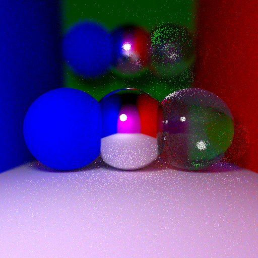

On obtient en moins de 4 minutes la même image avec cette fois 1000 rayons par pixel. Le résultat est meilleur.

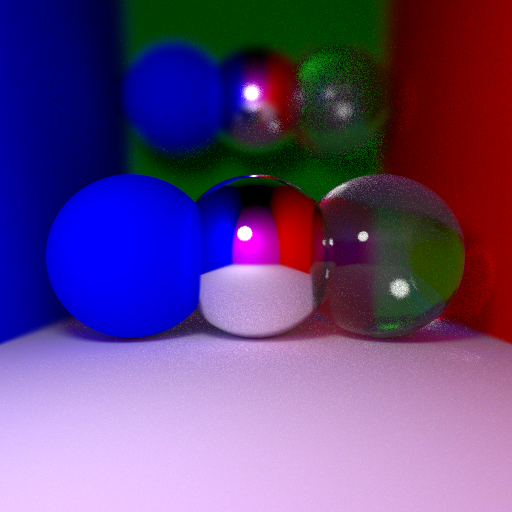

## Maillage 

Jusqu'à présent, les seuls objets représentés dans la scène était des sphères de centre et de rayon données. Afin de représenter d'autres types d'objets, rectangle, cylindre, voir même des formes complexes, un chien par exemple, il convient d'introduire la notion de **maillage** des surfaces.

Le maillage d'une surface consiste à découper cette surface en triangle.

Le maillage utilisé dans les exemples suivant est disponible [ici](https://free3d.com/fr/3d-model/australian-cattle-dog-v1--993323.html). C'est un maillage d'un chien.
Le fichier téléchargé est porte l'extension **.obj**, il contient :

- les sommets des triangles **v**
- les normales aux sommets **vn**
- les coordonnées de texture **vt**
- les faces **f**.

Le fichier `parserObj.cpp` permet de lire et traiter un fichier de maillage obj.

### Maillage naïf 

La première méthode consiste à parcourir, pour chaque rayon de la scène, l'ensemble des triangles du maillage et renvoyer, s'il existe le plus proche triangle intersecté.

Cette méthode augmente énormement le temps de calcul puisque le nombre de triangle à tester est très important (30000 pour le maillage de chien).

L'intersection d'une maille (un triangle) avec un rayon se calcule grâce à l'**algorithme de Möller Trumbore**.

L'ensemble des points P du triangle ABC peuvent être décrit par les coordonnées barycentrique &alpha;, &beta; et &gamma; (&alpha;, &beta;, &gamma; &ge; 0) tels que :

P = &alpha; . A + &beta; . B + &gamma; . C avec : &alpha; + &beta; + &gamma; = 1

ou encore :

P = A + &beta; . **e1** + &gamma; . **e2**

avec **e1** et **e2** les vecteurs dirigés par **AB** et **AC**

et
P = O + t . **u**

ainsi : &beta; . **e1** + &gamma; . **e2** - t . **u** = O - A

ou encore :

[**e1** **e1** -**u**].[&beta; &gamma; t] = **OA**

Ce dernier système d'équation se résout avec la **méthode de Kramer**, on obtient les solutions suivantes :

---

&beta; = - &lt; **e2**, **OA** &#10799; **u** &gt; / &lt; **u** , **N** &gt;

&gamma; = - &lt; **e1**, **OA** &#10799; **u** &gt; / &lt; **u** , **N** &gt;

t = - &lt; **OA** , **N** &gt; / &lt; **u** , **N** &gt;

---

L'algorithme est relativement efficace puisqu'il suffit de calculer une fois &lt; **OA** &#10799; **u** &gt; et &lt; **u** , **N** &gt; présent dans plusieurs équations.

Les résultats pour ce maillage naïf sont représentés ci-dessous. On obtient, pour des images de tailles (128,128) et pour un seul rayon l'image ci-dessous en 45 secondes.

Le résulat n'est pas très satisfaisant pour un temps d'attente relativement long.

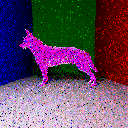

L'image ci-dessous est la même que précédemment avec 5 rayons et un chien mirroir.

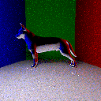

### Boîte englobante 

La méthode de maillage naïve est très complexe en temps de calcul. Une manière simple de l'améliorer consiste à utiliser une **boîte englobante**.
Il s'agit de la plus petite boîte entourant l'objet maillé.

En effet, de nombreux rayons passent très loin de l'objet à mailler et pourtant, un test d'intersection est réalisé pour chaque maille de l'objet. L'amélioration proposée ici consiste à faire une première vérification pour vérifier que le rayon passe bien proche de l'objet.

On construit donc une boîte englobante autour de l'objet, et on vérifie pour chaque rayon si il intersecte ou non cette boîte. si tel est le cas, on réalise les tests d'intersection pour les différentes mailles.

La boîte englobante est décrite par 2 points, le point des minimums et le point des maximums des coordonnées des sommets selon x, y et z.

On calcul ensuite l'intersection du rayon avec les 3 fois 2 plans de normales **x**, **y** et **z** constituant la boîte. Si l'intersection des intervalles formés par les intersections avec chacun de ces 2 plans est non vide, alors il y a intersection de la boîte.

L'intersection entre un rayon et un peu plan est décrit par les équations suivantes, pour un plan contenant le point A, de normale **N**, un rayon passant par O et dirigé par **u**, les points P du plan sont décrit par :

&lt; P-A , **N** &gt; = 0

&lt; O + t . **u** - A , **N** &gt; = 0

soit t = &lt; A-O , **N** &gt; / &lt; **u** , **N** &gt;

On compare le maximum des cordonnées minimales et le minimal des coordonnées maximales des intersections afin de vérifier si la boîte est intersectée.

On obtient les résultats présentés précédemment beaucoup plus rapidement. En 8 secondes pour une image (128,128) et un seul rayon contre 45 secondes avec la méthode naïve.

Les images ci-dessous sont de format (256,256) et sont réalisées avec 10 et 30 rayons respectivement. Une boule miroir est placé au dessus du chien afin d'avoir une vision du chien de l'autre côté.

Les résultats sont plutôt satisfaisant, toutefois les temps de calcul sont extrêmement longs.

Image de 10 rayons par pixel en 230 secondes (environ 4 minutes) :

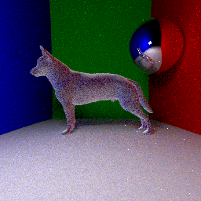

Image de 30 rayons par pixel en 730 secondes (environ 12 minutes) :

### Maillage optimisé 

La méthode de la boîte englobante permet un gain de temps important. On se propose d'améliorer encore cette technique afin de réduire considérablement le temps de calcul.

Le principe de cette optimisation est de **découper le maillage en sous-maillage** et d'appliquer à ces sous-maillages des boîtes englobantes. Ainsi, le volume total représenté par les boîtes sera plus faible que celui de la boîte englobante globale.

En pratique, on créé une structure d'arbre binaire en divisant récursivement un maillage en 2 sous-maillage de taille égale. Cette structure porte le nom de **BVH Bounding Volume Hierarchy**.
Les triangles sont ordonnés par indices selon le découpage du maillage ce qui facilite le stockage des triangles.

Au moment de vérifier l'intersection d'un rayon avec le maillage, on parcours l'arbre BHV en profndeur afin de vérifier si une maille intersecte le rayon. Le gain de temps est considérable, si la boîte d'une sous-maille n'est pas intersecté par le rayon, toutes les sous-branches de l'arbre ne sont pas inspectées.

On obtient pour une image de taille (256,256) avec un seul rayon par pixel l'image ci-dessous en environ **une seconde** contre plus de 20 secondes sans cette optimisation, soit un **gain de temps de d'un facteur 20**.

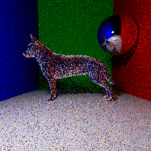

L'image ci-dessous est obtenue en enrion 37 secondes avec 100 rayons par pixels.

L'image ci-dessous, avec un chien couleur cyan, une image de taille (512,512) et 150 rayons par pixel est obtenue en environ 5 minutes (280 secondes).

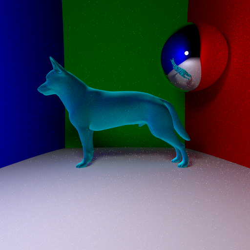

### Optimisation des normales 

Jusqu'à présent les triangles partageant un même sommet possédaient tous la même normale en ce sommet, ce qui donne un aspect boule à facette à l'image.
Afin d'améliorer le rendu, il est possible de donner une valeur différente à chacune des normales afin de donner un aspect plus lisse.

La solution est pour cela de calculer une normale par triangle qui sera au point d'intersection rayon-triangle et une combinaison linéaire des normales à chaque sommet.

Ainsi on obtient l'image ci-dessous, la différence avec l'image précédente est remarquable. On remarque que l'on ne discerne plus sur le dos du chien les mailles, le maillage semble plus lisse.

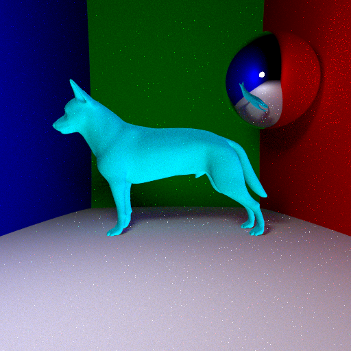

### Optimisation du parcours 

Cette optimisation consiste à réduire encore le nombre de sous-branche de l'arbre BVH lors du parcours en profondeur. En effet, si une intersection dans une branche a été trouvée, il n'est pas nécessaire d'aller explorer la branche opposée si l'on sait que celle si est plus distante de la source de lumière. On gagne ainsi un grand nombre de test sur les rayons qui intersectent plusieurs sous-maillages.

De plus, au lieu de commencer le parcours en profondeur de l'arbre BVH toujours par le fils gauche, il est possible de commencer par le fils le plus proche du rayon et ainsi maximiser ces chances de ne pas avoir à continuer la descente de l'autre branche de l'arbre (qui sera plus distante).

Technique par encore implémenter.

## Feedback sur le MOS 

- Points positifs :

  - cours très intéressant
  - le mélange de théorie et de mise en pratique simultané rend le travail très stimulant et l'évolution de l'image d'un modèle très simple à un modèle plus complexe rend le court d'autant plus motivant

- Point négatif :
  - la connaissance du C++ et des outils de développement est plus ou moins prise pour acquis, ce qui n'est pas le cas pour tout le monde.
