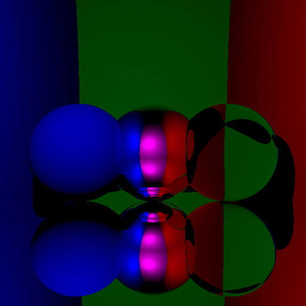

# MOS 2.2 - Informatique Graphique

Enseignant : Nicolas Bonneel

Etudiant : Julien Verdun

Date : 06/01/2021

## Ray Tracing

Le ray tracing est une technique de calcul d'optique par ordinateur, utilisée pour le rendu en synthèse d'image ou pour des études de systèmes optiques

On décrit dans cette partie l'implémentation d'un algorithme de **Ray Tracing**. Les différentes étapes permettant de complexifier notre algorithme sont expliquées.

Le fichier `raytracer.cpp` contient les classes **C++** et le **main** nécessaires pour créer les images présentées plus bas.

### Ray Tracing primitif

Le premier Raytracer implémenté est très rudimentaire.

On représente une **source de lumière blanche** par une source omnidirectionnelle placée en un point L.
Une caméra est placée en un point C. Elle est composée d'une grille de pixels placée à une distance Z de C et de taille (W,H), soit W\*H pixels au total.

Dans un premier temps, on place une sphère devant la caméra. C'est une sphère de centre O et de rayon R.

La démarche est la suivante. On trace des demi-droites partant du centre de la caméra C et dirigé par un vecteur **u**. Une demi-droite traverse la grille en un pixel, il y a donc W\*H demi-droites, passant par C et dirigée par le vecteur unitaire :

**u** = ( j-W/2, i-H/2, -W/(2.tan(&alpha;/2)))

où (i,j) sont les coordonnées du pixel sur l'écran de la caméra.

Pour chaque demi-droite, on calcule l'intersection avec la sphère.
On résoud :

t2 + 2.t.&lt;**u**,**CO**&gt; + ||**CO**||2 - R2 = 0

Si l'intersection existe (**au moins une solution t positive**), on représente le pixel correspondant en blanc, sinon on le laisse noir.

Ainsi on obtient la Figure représentée ci-dessous. La sphère est bien représentée en blanc et le reste en noir.

**Remarque :** avec cette méthode assez primitive, il n'est pas possible d'observer le volume de la sphère, ainsi que les ombres créées par la lumière.

Les classes implémentées sont les suivantes :

- une classe **Vector** : elle contient les coordonnées du vecteur et différentes méthodes pour surcharger les opérations d'addition, soustraction, produit scalaire et produit par une constante ainsi que de calcul de la norme
- une classe **Sphere** : elle contient le centre et le rayon de la sphère
- une classe **Ray** : elle contient un point du rayon et son vecteur directeur.

### Ajout de l'intensité lumineuse

On change ici la couleur attribuée à un pixel de la caméra afin d'obtenir du contraste et de discerner les volumes des objets.

Au lieu de donner une couleur blanche à un pixel dont un rayon serait entré en collision avec un objet, on donne une couleur dont l'intensité est variable.

On calcule l'intensité de la lumière en un point P d'un objet selon la formule :

Ip = I/(4.&pi;.||**LP**||2) . .&lt;**N**,**PL**/||**PL**||&gt; . &rho; / &pi;

avec :

- I l'intensité de la source lumineuse au point L
- **N** la normale à l'objet (la sphère) au point P (vecteur unitaire)
- &rho; l'albédo de la sphère, i-e la fraction de la lumière que la sphère réfléchit.

Ainsi on obtient la Figure représentée ci-dessous. La sphère, représentée avec un albedo rouge, est bien représentée en rouge et le reste en noir. On peut cette fois mieux apprécier le volume de la sphère et on peut clairement identifier la localisation de la source de lumière grâce aux différences d'intensiter lumineuses (les ombres sont mieux représentés). Ce raytracer est plus performant que la version précédente.

### Création d'une scène

On désire à présent **complexifier la scène observée**. Jusqu'à présent, seul une sphère était placée devant la caméra.

On implémente une classe **Scene** contenant un vecteur d'objets, qui contiendra les objets (par exemple des sphères) placés devant la caméra.

Afin de bien représenter les objets les un par rapport aux autres, il convient de pouvoir déterminer leur profondeur dans l'espace. Ainsi pour réaliser cette modification, une méthode est implémentée afin de vérifier pour un rayon donné, les objets de la scène qui intercepte ce rayon, et de ne garder que l'objet le plus proche de la caméra (l'objet qui va cacher les objets derrière lui).

On réalise un essai en créant une scène composée de :

- trois sphères, de gauche à droite bleue, blanche et rouge
- 2 murs à gauche et à droite respectivement bleu et rouge
- 2 murs en face de la caméra et derrière la caméra (invisible donc) respectivement vert et magenta
- 1 mur au sol de couleur blanche.

Les murs sont représentés par des sphéres de très grand rayon et de centre très éloigné.
Le résultat obtenu est présenté sur la Figure ci-dessous :

**Remarque** : Le résultat est assez satisfaisant, toutefois certaines améliorations sont possibles :

- les ombres des sphères ne sont pas projetées sur les murs alentours
- la luminosité de la lumière sur les murs est très faible, leur couleur n'est pas très bien perceptible.

### Correction Gamma

On se propose ici d'améliorer le contraste des objets. En effet, sur la dernière scène obtenue, nous avons relevé la faible luminosité des murs en arrière plan.

La **correction Gamma** permet d'améliorer le contraste en réalisant une opération simple sur l'intensité lumineuse calculée de chaque pixel :

I = Icalculee1/&gamma;

avec &gamma; = 2,2 et 1/&gamma; = 0,45.

La correction Gamma permet d'obtenir le résultat ci-dessous. La luminosité des pixels représentant les murs est plus importante. Le rendu est meilleur.

### Ombres portées

On souhaite encore améliorer le rendu en ajoutant les **ombres portées**, c'est-à-dire les ombres des objets projetées sur les surfaces.

La stratégie est la suivante. On envoie des rayons dans toutes les directions (vers chaque pixel de l'écran). Pour un rayon donné, on trouve l'intersection avec un objet de la scène puis on regarde si le rayon entre cette intersection et la source de lumière coupe un autre objet. Si tel est le cas, on rend le pixel d'intersection plus sombre.

On obtient un premier résultat présenté sur la Figure ci-dessous. On remarque que les ombres sont bien présentes, toutefois, l'image est très bruitée.

Le bruit s'explique par les incertitudes de calcul dû à la précision numérique de la machine. Ainsi, le point d'intersection se retrouve dans la surface au lieu d'être sur la surface. Pour éviter cela, on déplace le point d'intersection d'une petite quantité &epsilon; vers l'extérieur de l'objet.

Avec cette légère modification, on obtient le résultat présenté ci-dessous, le bruit n'est plus présent et les ombres sont bien visibles.

### Surfaces miroir

Les surfaces représentées jusqu'à présent sont des surfaces opaques qui possèdent un albédo. On se propose ici de représenter un autre type de surface, les **surfaces miroir**.

Un rayon lumineux se reflète sur une telle surface avec un angle de réflexion par rapport à la normale de la surface égal à l'angle d'incidence. Les réflexions peuvent être multiples dans le cas de plusieurs surfaces miroir.

On implémente ces types de surfaces en créant une fonction getColor récursive qui permet de donner la couleur entre l'intersection d'un rayon et d'une surface opaque, ou le cas écheant entre le rayon réfléchi et une surface miroir.

Avec cette propriété, notre **raytracer** devient un **pathtracer**.

Le rayon incident **i** est réfléchi par la surface miroir en un rayon **r** tel que :

**r** = **i** - 2<**i**,**N**>**N**

On remplace la sphère centrale des scènes précédentes par une surface miroir. On obtient le résultat ci-dessous.

On rencontre le même problème que précédemment, du bruit est présent sur la surface dû aux erreurs numériques. Le résultat après correction est le suivant.

La sphère centrale permet bien de refléter le mur derrière l'écran, le mur magenta et les sphères et murs environnants.

### Surfaces transparents

On se propose ici de représenter un autre type de surface, les **surfaces transparentes**.

On fait l'hypothèse qu'une surface transparente réfléchie l'intégralité d'un rayon ou transmet l'intégralité du rayon, on ne tient pas compte de la **transmission de Fresnel**.

On utilise la **loi de Snell-Descartes**, pour une surface de normale **N** séparant deux milieux d'indices respectifs n1 et n2, un rayon incident dans le milieu d'indice n1 avec un angle &theta;i est transmis dans le milieu d'indice n2 avec un angle &theta;t tel que :

n1 sin(&theta;i) = n2 sin(&theta;t)

Grâce à cette loi, on peut exprimer les composantes tangentielle et normale du vecteur unitaire directeur du rayon transmis **T** :

**TN** = - sqrt(1 - (n1/n2)2(1-<**i**,**N**>2)) **N**

**TT** = n1/n2 (**i** - <**i**,**N**>**N**)

Connaissant la direction du rayon tranmis par la surface transarente, il est alors possible de connaître la couleure du pixel à afficher en cherchant l'intersection de ce rayon avec le reste de la scène.

On modifie la sphère de droite (sphère rouge) en une surface transparente. On obtient le résultat présenté sur la Figure ci-dessous. La sphère est bien transparente et laisse apparaître avec une inversion de la direction les murs de droite et du fond.

Une autre représentation est visible ci-dessous en remplaçant le sol par un miroir.
On calcule le temps nécessaire pour créer cette scène. L'algorithme donne les performances suivantes :

- 0.918 seconde pour générer l'image sans le sol en miroir
- 1.137 secondes pour générer l'image avec le sol en miroir.

### Transmission de Fresnel

Lors de la transmission d'un rayon par une surface transparente, une partie du rayon est en réalité réfléchie par la surface, selon les lois de Fresnel.

Dans l'approximation de Schlick, le rayon incident se divise en un rayon réfléchi **R** et un rayon transmis **T** selon les formules suivantes :

R = k0 + (1-k0)(1-|<**N**,**i**>|)5

T = 1 - R

avec k0 = (n1-n2)2/(n1+n2)2

Pour implémenter la transmission de Fresnel, deux stratégies ont été testées.

La **première stratégie** consiste à calculer la valeur d'un pixel transparent en faisant une moyenne pondérée par les coefficients R et T du rayon réfléchi et du rayon réfracté. L'inconvénient de cette méthode est son temps de calcul. En effet, la méthode de calcul de la couleur étant récursive, l'appeler 2 fois pour calculer la valeur d'un pixel transparent conduit à fait 2N calcul pour N rebonds, la complexité devient très vite importante.

Les résultats de cette méthode sont très concluants puisqu'en moins de 2 secondes, les deux images ci-dessous sont générées avec un rendu proche de la réalité.

La **deuxième stratégie** consiste à calculer la valeur d'un pixel transparent en faisant une moyenne de plusieurs chemins complets pour lesquels à chaque intersection avec une surface transparente, on choisit aléatoirement d'émettre un rayon réfléchi ou réfracté, en générant un nombre entre 0 et 1, et en le comparant au coefficient R. Si le nombre généré est inférieur à R, le rayon sera réfléchi, sinon il sera réfracté.

Les résultats de cette méthode semble un peu moins performant. en effet, en générant et moyennant la valeur du pixel pour 30 rayons complets, on obtient le résultat ci-dessous. La qualité de la transparence est moins importante qu'avec la première méthode, on observe un léger bruit. De plus, le temps pour générer l'image est plus grand avec environ 6 secondes pour 10 rayons et 20 secondes pour 30 rayons.

# TO-DO :

- mettre un feedback sur le cours (si a aimé, si deja codé en c++, si c'était difficile, intéressant, etc)
- faire une table des matières
