# MOS 2.2 - Informatique Graphique

Ce dépôt contient le code C++ implémentant un path-tracer. Les étapes d'évolution sont décrites ci-dessous et illustrées par des exemples.
Le fichier `README.md` contient le rapport détaillé avec les explications théoriques.

Le rendu final du rapport est directement présenté ci-dessous :

## Table des matières

I. [Rendu final](#rendufinal)

1.  [Garage à voitures](#garagevoiture)
2.  [Scène de combat](#scenecombat)

II. [Ray Tracing](#raytracing)

1.  [Ray Tracing primitif](#raytracingprimitif)
2.  [Ajout de l'intensité lumineuse](#intensitelumineuse)
3.  [Création d'une scène](#scenecreation)
4.  [Correction Gamma](#correctiongamma)
5.  [Ombres portées](#ombresportees)
6.  [Surfaces miroir](#surfacesmiroir)
7.  [Surfaces transparentes](#surfacestransparentes)
8.  [Transmission de Fresnel](#fresnel)
9.  [Eclairage indirect](#eclairageindirect)

    a) [Generation de nombre aléatoire](#randomnumber)

    b) [Résultat de l'éclairage indirect](#resulteclairageindirect)

10. [Parallélisation des calculs](#parallelisation)
11. [Crénelage](#crenelage)
12. [Ombres douces](#ombredouce)

    a) [Approche naïve](#approchenaive)

    b) [Approche intégrale](#approcheintegrale)

13. [Changement du modèle de caméra](#changementcamera)

14. [Maillage](#maillage)

    a) [Maillage naïf](#maillagenaif)

    b) [Boîte englobante](#boiteenglobante)

    c) [Maillage optimisé](#maillageoptimise)

    d) [Optimisation des normales](#normalesoptimisees)

15. [Textures](#textures)

16. [Mouvement de la caméra](#mouvementcamera)

III. [Feedback sur le MOS](#feedback)

---

**Enseignant** : Nicolas Bonneel

**Etudiant** : Julien Verdun

**Dates** : du 6 janvier 2021 au 24 mars 2021

---

## Rendu final 

### Garage à voitures 

La première idée de rendu final était une scène composée de plusieurs véhicules, rangés dans un garage.

Plusieurs essais ont été réalisés avec notamment les deux modèles 3D suivant :
- une Bugatti https://free3d.com/fr/3d-model/bugatti-chiron-2017-model-31847.html
- un concept car https://free3d.com/fr/3d-model/3d-super-car-12832.html

Malheureusement les résultats obtenus n'ont pas été concluant. Le facteur limitant est notamment le temps de calcul des images ci-dessous. 

La bugatti a donné le rendu ci-dessous avec seulement un rayon par pixel en 4200 secondes, donc plus d'une heure. 

Le concept car a donné le rendu ci-dessous avec 3 rayons par pixel en 6000 secondes, donc presque 2 heures. 

Ainsi, le grand temps de calcul pour seulement un objet et très peu de rayons par pixel m'a décourager à créer une scène avec plusieurs objets et des centaines de rayons par pixel, le temps de calcul aurait été astronomique. 

### Scène de combat 

J'ai donc décidé en regardant les modèles disponibles en ligne de créer une scène de combat. 

Les maillages des différents objets sont disponibles aux liens suivants : 
- soldat avec grenade https://free3d.com/fr/3d-model/wwii-soldier-throwing-grenade-v2--322379.html
- soldat avec bazooka https://free3d.com/fr/3d-model/wwii-soldier-with-bazooka-v1--231985.html
- soldat avec mitraillette https://free3d.com/fr/3d-model/wwii-soldier-with-rifle-v1--175847.html
- char Panzer https://free3d.com/fr/3d-model/wwii-tank-germany-panzer-iii-v1--870820.html
- char soviétique https://free3d.com/fr/3d-model/wwii-tank-soviet-union-t70-v1--971170.html
- avion japonais  https://free3d.com/fr/3d-model/wwii-plane-japan-kawasaki-ki61-v1--150484.html.

J'ai réalisé des premiers rendus avec peu de rayons par pixel et une petite image (256 x 256) afin de placer les éléments dans la scène. 

Puis j'ai augmenté le nombre de rayons par pixel, ci-dessous une image avec 500 rayons calculée en 222 secondes (moins de 4 minutes).

L'image est encore très pixelisée malgré les 500 rayons, j'augmente donc la taille de l'image, en 512 x 512 ci-dessous :  

Rendu avec une image 1024 x 1024, 1 rayons par pixel, calculée en 12 secondes :

Dernier rendu avec une image 1024 x 1024, 1000 rayons par pixel, calculée en 7600 secondes soit plus de 2 heures :

**Problèmes rencontrés** : les textures des avions ne se chargent pas, d'où les couleurs.

## Ray Tracing 

Le ray tracing est une technique de calcul optique par ordinateur, utilisée pour le rendu en synthèse d'image ou pour des études de systèmes optiques

Le fichier `raytracer.cpp` contient les classes **C++** et la fonction **main** nécessaires pour créer les images présentées plus bas.

### Ray Tracing primitif 

Le premier Raytracer implémenté est très rudimentaire.

On représente une **source de lumière blanche** par une source omnidirectionnelle. Une caméra est composée d'une grille de pixels. Dans un premier temps, on place une sphère devant la caméra

Ainsi on obtient la Figure représentée ci-dessous. La sphère est bien représentée en blanc et le reste en noir.

**Remarque :** avec cette méthode assez primitive, il n'est pas possible d'observer le volume de la sphère, ainsi que les ombres créées par la lumière.

### Ajout de l'intensité lumineuse 

On change ici la couleur attribuée à un pixel de la caméra afin d'obtenir du contraste et de discerner les volumes des objets.

Au lieu de donner une couleur blanche à un pixel dont un rayon serait entré en collision avec un objet, on donne une couleur dont l'intensité est variable (notamment avec la distance).

Ainsi on obtient la Figure représentée ci-dessous. La sphère, représentée avec un albedo rouge, est bien représentée en rouge et le reste en noir. On peut cette fois mieux apprécier le volume de la sphère et on peut clairement identifier la localisation de la source de lumière grâce aux différences d'intensité lumineuse (les ombres sont mieux représentées). Ce raytracer est plus performant que celui de la version précédente.

### Création d'une scène 

On désire à présent **complexifier la scène observée**. Jusqu'à présent, seule une sphère était placée devant la caméra.

On réalise un essai en créant une scène composée de :

- trois sphères bleue, blanche et rouge (de gauche à droite)
- 2 murs à gauche et à droite respectivement bleu et rouge
- 2 murs en face de la caméra et derrière la caméra (invisible donc) respectivement vert et magenta
- 1 mur au sol de couleur blanche.

Les murs sont représentés par des sphères de très grand rayon et de centre très éloigné.
Le résultat obtenu est présenté sur la Figure ci-dessous :

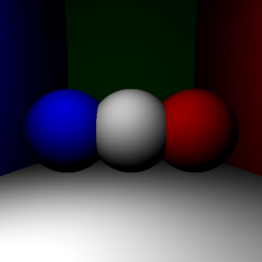

**Remarque** : Le résultat est assez satisfaisant, toutefois certaines améliorations sont possibles :

- les ombres des sphères ne sont pas projetées sur les murs alentours
- la luminosité de la lumière sur les murs est très faible, leur couleur n'est pas très bien perceptible.

### Correction Gamma 

On se propose ici d'améliorer le contraste des objets. En effet, sur la dernière scène obtenue, nous avons relevé la faible luminosité des murs en arrière plan.

La **correction Gamma** permet d'améliorer le contraste en réalisant une opération simple sur l'intensité lumineuse calculée de chaque pixel.

La correction Gamma permet d'obtenir le résultat ci-dessous. La luminosité des pixels représentant les murs est plus importante. Le rendu est meilleur.

### Ombres portées 

On souhaite encore améliorer le rendu en ajoutant les **ombres portées**, c'est-à-dire les ombres des objets projetées sur les surfaces.

On obtient un premier résultat présenté sur la Figure ci-dessous. On remarque que les ombres sont bien présentes, toutefois, l'image est très bruitée.

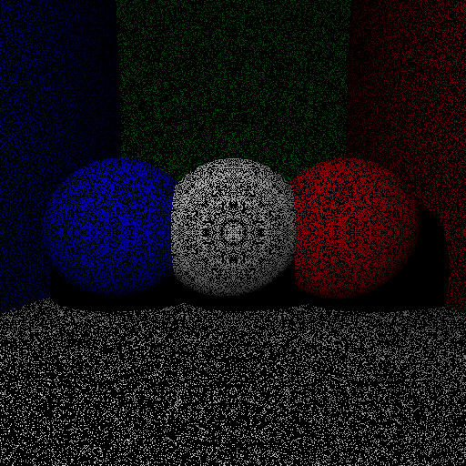

Le bruit s'explique par les incertitudes de calcul dûes à la précision numérique de la machine.

Après un léger décalage, on obtient le résultat présenté ci-dessous, le bruit n'est plus présent et les ombres sont bien visibles.

### Surfaces miroir 

Les surfaces représentées jusqu'à présent sont des surfaces opaques qui possèdent un albédo. On se propose ici de représenter un autre type de surface, les **surfaces miroir**.

On remplace la sphère centrale des scènes précédentes par une surface miroir. On obtient le résultat ci-dessous.

On rencontre le même problème que précédemment, du bruit est présent sur la surface dû aux erreurs numériques. Le résultat après correction est le suivant.

La sphère centrale permet bien de refléter le mur derrière l'écran, le mur magenta et les sphères et murs environnants.

### Surfaces transparentes 

On se propose ici de représenter un autre type de surface, les **surfaces transparentes**.

On modifie la sphère de droite (sphère rouge) en une surface transparente. On obtient le résultat présenté sur la Figure ci-dessous. La sphère est bien transparente et laisse apparaître avec une inversion de la direction les murs de droite et du fond.

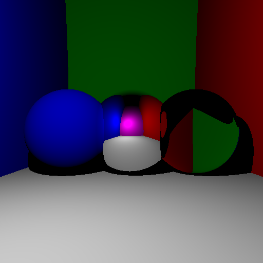

Une autre représentation est visible ci-dessous en remplaçant le sol par un miroir.
On calcule le temps nécessaire pour créer cette scène. L'algorithme donne les performances suivantes :

- 0.918 seconde pour générer l'image sans le sol en miroir
- 1.137 secondes pour générer l'image avec le sol en miroir.

### Transmission de Fresnel 

Lors de la transmission d'un rayon par une surface transparente, une partie du rayon est en réalité réfléchie par la surface, selon les lois de Fresnel.

Pour implémenter la transmission de Fresnel, deux stratégies ont été testées.

La **première stratégie** consiste à calculer la valeur d'un pixel transparent en faisant une moyenne pondérée par les coefficients R et T du rayon réfléchi et du rayon réfracté. L'inconvénient de cette méthode est son temps de calcul.

Les résultats de cette méthode sont très concluants puisqu'en moins de 2 secondes, les deux images ci-dessous sont générées avec un rendu proche de la réalité. Toutefois cette méthode n'est rapide que parce qu'il s'agît de formes très simples.

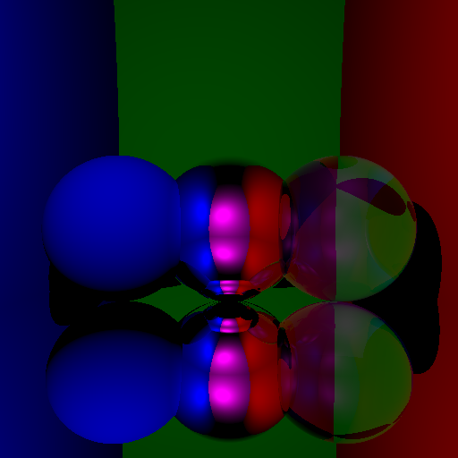

La **deuxième stratégie** consiste à calculer la valeur d'un pixel transparent en faisant une moyenne de plusieurs chemins complets pour lesquels à chaque intersection avec une surface transparente, on choisit aléatoirement d'émettre un rayon réfléchi ou réfracté, en générant un nombre entre 0 et 1, et en le comparant au coefficient R. Si le nombre généré est inférieur à R, le rayon sera réfléchi, sinon il sera réfracté.

Les résultats de cette méthode semble un peu moins performant. En effet, en générant et moyennant la valeur du pixel pour 30 rayons complets, on obtient le résultat ci-dessous. La qualité de la transparence est moins importante qu'avec la première méthode, on observe un léger bruit. De plus, le temps pour générer l'image est plus grand avec environ 6 secondes pour 10 rayons et 20 secondes pour 30 rayons. Toutefois, on utilisera cette méthode par la suite car elle seta plus efficace pour des formes complexes.

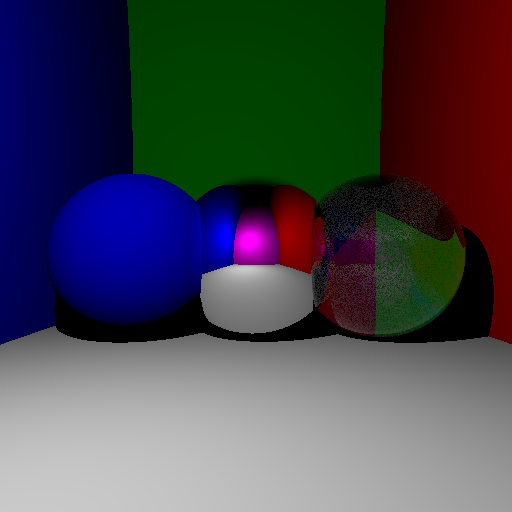

### Eclairage indirect 

Avec le pathtracer actuel, les surfaces avec un éclairage rasant possèdent une faible intensité lumineuse.

En réalité, les surfaces environnentes réflechissent une partie de la lumière pour éclairer ces surfaces "rasantes" et ainsi augmenter la quantité de lumière observée. Ainsi les surfaces se comportent comme des sources de lumière secondaires. On parle d'**éclairage indirect**.

Avec un seul rayon indirect généré aléatoirement par pixel, on obtient le résultat ci-dessous en environ 1 seconde. L'image semble bruitée, le résultat n'est pas suffisament performant.

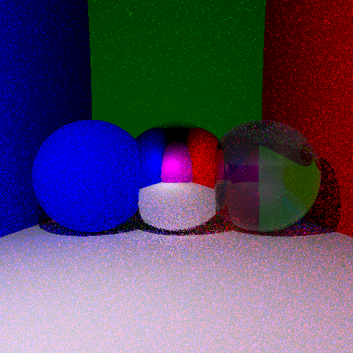

Avec 10 rayons indirects générés aléatoirement par pixel, on obtient le résultat ci-dessous en environ 10 secondes. L'image semble toujours bruitée mais le résultat est plus satisfaisant que le précédent.

Avec 100 rayons indirects générés aléatoirement par pixel, on obtient le résultat ci-dessous en environ 100 secondes. On aperçoit encore légèrement le bruit même si le résultat est très satisfaisant.

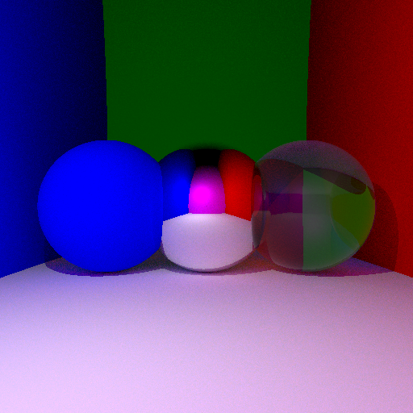

Lorsque l'on compare ce résultat avec l'image sans éclairage indirect, on s'aperçoit entre autre que le sol, qui apparaissait blanc (sa couleur de définition), possède maintenant une teinte influencée par la couleur des murs qui l'entourent (bleu et rouge).

L'image ci-dessous présente la combinaison de l'éclairage indirect et de la transmission de Fresnel au niveau de la sphère transparente, en combinant les méthodes aléatoires pour optimiser les calculs, on obtient le résultat en 80 secondes, 20 secondes de moins que précédemment.

### Parallélisation des calculs 

Chaque pixel de l'image étant calculé de manière indépendante des autres pixels, on peut paralléliser la boucle de l'algorithme afin que les calculs soient exécutés en parallèle.

En appliquant cette méthode, on parvient à réduire le temps d'exécution de notre algorithme à 10 secondes contre 80 secondes précédemment.

### Crénelage 

Lorsque l'on observe une des images générées précédemment, on s'aperçoit que les bords des surfaces sont crénelés (en forme d'escalier).

La raison de ce phénomène est que les rayons intersectent l'écran au milieu des pixels et deux rayons issues de deux pixels voisins peuvent, avec la distance entre l'écran et la surface, ne pas tout les deux appartenir à la surface ou inversement.

On corrige ce problème et on obtient le résultat ci-dessous, le crénelage n'est plus visible.

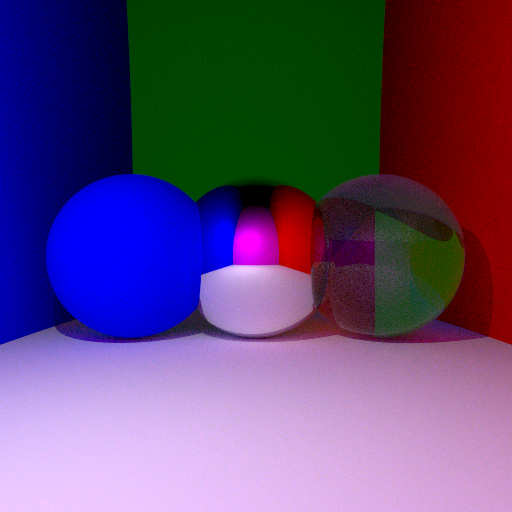

### Ombre douce 

Jusqu'à présent, nous utilisions une source de lumière ponctuelle, qui émet dans toutes les directions de l'espace, pour éclairer la scène.

Cela conduit notamment à des ombres très tranchées.
Afin d'adoucir les ombres, on se propose ici de remplacer cette source ponctuelle par une **surface émissive**, une sphère par exemple, qui se rapproche plutôt bien d'une ampoule.

L'éclairage indirect n'est pas impacté par cette modification. En revanche l'éclairage indirect n'est pas calculé de la même manière.

#### Approche naive 

Dans une première approche dîtes naïve, on retire la source ponctuelle et on ne prend en compte que les reflets sur une surface émissive (sphère blanche).

Le résultat de l'approche naïve est présenté ci-dessous. Pour une surface émissive de rayon 5, l'image est très bruitée, le résultat est moins bon que précédemment. La source est visible dans le mirroir.

En augmantant le rayon de la source ponctuelle à 15, le résultat est meilleur, l'image est moins bruitée.

**Remarque** : on aperçoit la surface émissive en haut à gauche de l'image.

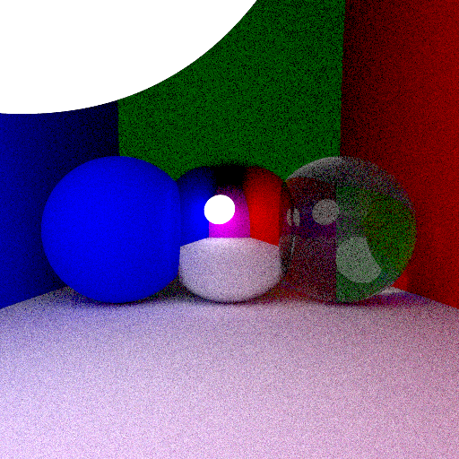

#### Approche intégrale 

Quant il suffisait de viser la source ponctuelle avec un rayon pour calculer l'éclairage direct dans le modèle précédent, il s'agît à présent d'intégrer sur la demi-sphère de la surface émissive qui "voit" la surface éclairée.

Les Figures ci-dessous montrent les résultats de cette méthode.

Les deux images ci-dessous montrent le résultat pour des surfaces émissives de rayon 1 et 15.

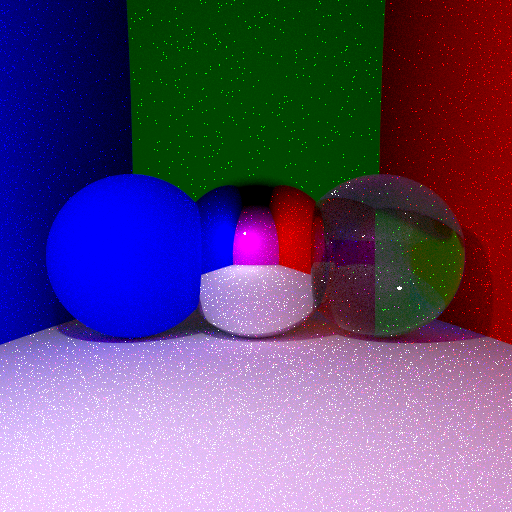

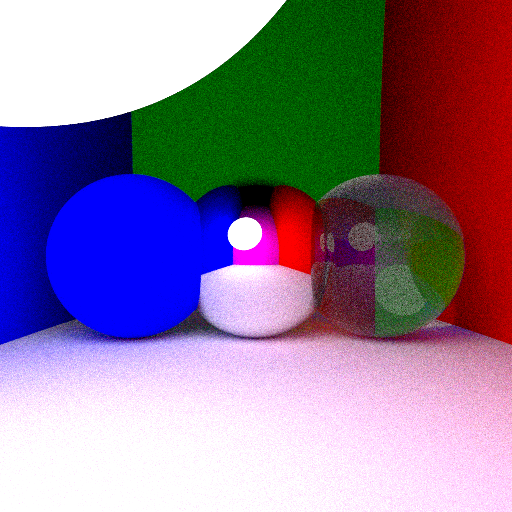

Un léger bruit est toujours présent, il est dû notamment aux approximations numériques qui reste des cas rares.

En corrigeant le problème et toujours avec une source de rayon 1 on obtient un meilleur résultat ci-dessous.

La Figure ci-dessous présente le résultat pour une surface émissive de rayon 5.
On observe une **caustique** (zone où la lumière de la surface émissive est concentrée) sous la boule transparente.

### Changement du modèle de caméra 

La caméra utilisée initialement était une caméra fonctionnant comme un obturateur ponctuel. On modélise ici la caméra par un obturateur d'ouverture non ponctuelle.

Avec un tel dispositif, des objets qui ne sont pas à la même distance n'ont pas la même nêteté, cela dépend de la **profondeur de champ**.

Afin de tester le nouveau type de caméra, on duplique les 3 sphères des images précédentes et on les place en arrière plan au dessus du sol.

On obtient le résultat ci-dessous pour 100 rayons par pixel en environ 18 secondes.
On remarque bien l'effet attendu de netteté relative et de profondeur de champ, toutefois l'image est légèrement bruitée.

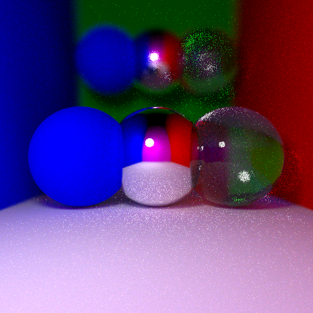

On obtient en moins de 4 minutes la même image avec cette fois 1000 rayons par pixel. Le résultat est meilleur.

## Maillage 

Jusqu'à présent, les seuls objets représentés dans la scène étaient des sphères de centre et de rayon données. Afin de représenter d'autres types d'objets, rectangle, cylindre, voir même des formes complexes, un chien par exemple, il convient d'introduire la notion de **maillage** des surfaces. Le maillage d'une surface consiste à découper cette surface en triangle.

Le maillage utilisé dans les exemples suivants est disponible [ici](https://free3d.com/fr/3d-model/australian-cattle-dog-v1--993323.html). C'est un maillage d'un chien.

Le fichier `parserObj.cpp` permet de lire et traiter un fichier de maillage obj.

### Maillage naïf 

La première méthode consiste à parcourir, pour chaque rayon de la scène, l'ensemble des triangles du maillage et de renvoyer, s'il existe le plus proche triangle intersecté.

Les résultats pour ce maillage naïf sont représentés ci-dessous. On obtient, pour des images de tailles (128,128) et pour un seul rayon l'image ci-dessous en 45 secondes.

Le résulat n'est pas très satisfaisant pour un temps d'attente relativement long.

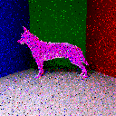

L'image ci-dessous est la même que précédemment avec 5 rayons et un chien mirroir.

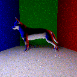

### Boîte englobante 

La méthode de maillage naïve est très complexe en temps de calcul. Une manière simple de l'améliorer consiste à utiliser une **boîte englobante**.
Il s'agit de la plus petite boîte entourant l'objet maillé.

En effet, de nombreux rayons passent très loin de l'objet à mailler et pourtant, un test d'intersection est réalisé pour chaque maille de l'objet. L'amélioration proposée ici consiste à faire une première vérification pour vérifier que le rayon passe bien proche de l'objet.

On obtient les résultats présentés précédemment beaucoup plus rapidement. En 8 secondes pour une image (128,128) et un seul rayon contre 45 secondes avec la méthode naïve.

Les images ci-dessous sont de format (256,256) et sont réalisées avec 10 et 30 rayons respectivement. Une boule miroir est placée au dessus du chien afin d'avoir une vision du chien de l'autre côté.

Les résultats sont plutôt satisfaisants, toutefois les temps de calcul sont extrêmement longs.

Image avec 10 rayons par pixel en 230 secondes (environ 4 minutes) :

Image avec 30 rayons par pixel en 730 secondes (environ 12 minutes) :

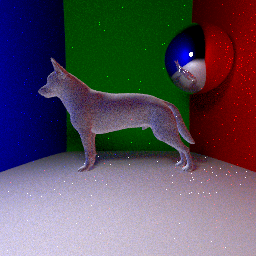

### Maillage optimisé 

La méthode de la boîte englobante permet un gain de temps important. On se propose d'améliorer encore cette technique afin de réduire considérablement le temps de calcul.

Le principe de cette optimisation est de **découper le maillage en sous-maillage** et d'appliquer à ces sous-maillages des boîtes englobantes. Ainsi, le volume total représenté par les boîtes sera plus faible que celui de la boîte englobante globale.

On obtient pour une image de taille (256,256) avec un seul rayon par pixel l'image ci-dessous en environ **une seconde** contre plus de 20 secondes sans cette optimisation, soit un **gain de temps d'un facteur 20**.

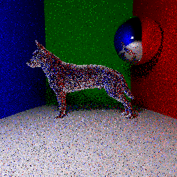

L'image ci-dessous est obtenue en environ 37 secondes avec 100 rayons par pixels.

L'image ci-dessous, avec un chien couleur cyan, une image de taille (512,512) et 150 rayons par pixel est obtenue en environ 5 minutes (280 secondes).

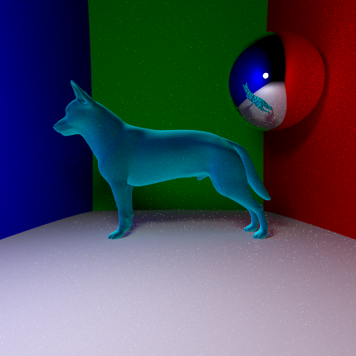

### Optimisation des normales 

Jusqu'à présent les triangles partageant un même sommet possédaient tous la même normale en ce sommet, ce qui donne un aspect boule à facette à l'image.
Afin d'améliorer le rendu, il est possible de donner une valeur différente à chacune des normales afin de donner un aspect plus lisse.

On obtient l'image ci-dessous, la différence avec l'image précédente est remarquable. On remarque que l'on ne discerne plus sur le dos du chien les mailles, le maillage semble plus lisse.

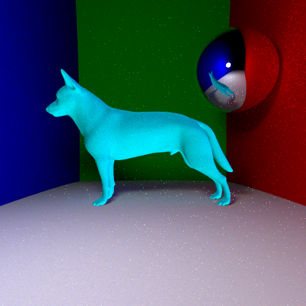

### Optimisation du parcours 

Cette optimisation consiste à réduire encore le nombre de sous-branche de l'arbre BVH lors du parcours en profondeur.

**Remarque** : Technique non implémentée.

## Textures 

Les objets 3D, en particulier le chien représenté précédemment est fournit avec une image contenant les textures. De plus, le fichier obj contenant les mailles contient également pour chaque sommet de chaque triangle, des cordonnées correspondants aux coordonnées du triangle de texture dans l'image de rendu des textures.

On utilise ensuite le fichier **stb_image** afin de charger la texture (**stbi_load**) et de l'appliquer au chien. L'image ci-dessus montre le résultat :

La correction gamma étant déjà appliquée aux textures, il faut prendre soin de mettre les valeurs de texture à la puissance 2,2 afin de ne pas cumuler 2 corrections gamma.

On obtient un résultat plus proche du résultat attendu.

## Mouvement de la caméra 

On améliore le rendu en donnant la possibilité à la caméra de bouger par rapport à la scène.

On obtient les deux images ci-dessous pour différents paramètres de centre de caméra et d'angles de rotation.

**Remarque** : on a rajouté dans cette scène un autre objet (un **dumbell**, disponible gratuitement au téléchargement à cette adresse https://free3d.com/fr/3d-model/dumbells-v1--867151.html).

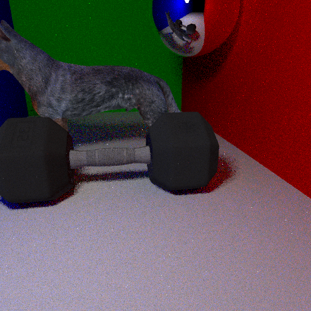

## Feedback sur le MOS 

- Points positifs :

  - cours très intéressant
  - le mélange de théorie et de mise en pratique simultané rend le travail très stimulant et l'évolution de l'image d'un modèle très simple à un modèle plus complexe rend le court d'autant plus motivant

- Point négatif :
  - la connaissance du C++ et des outils de développement est plus ou moins prise pour acquis, ce qui n'est pas le cas pour tout le monde
  - parfois difficile de passer de la théorie à la pratique, par exemple après l'explication de la lumière indirecte qui est assez complexe, il est difficile de rapidement digérer ce qui a été expliqué et de faire le lien avec le code à modifier.
